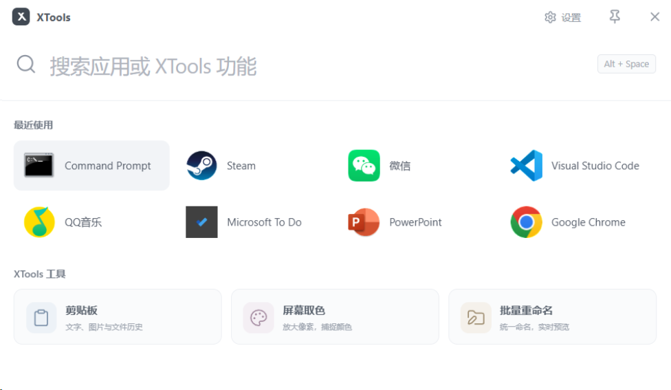
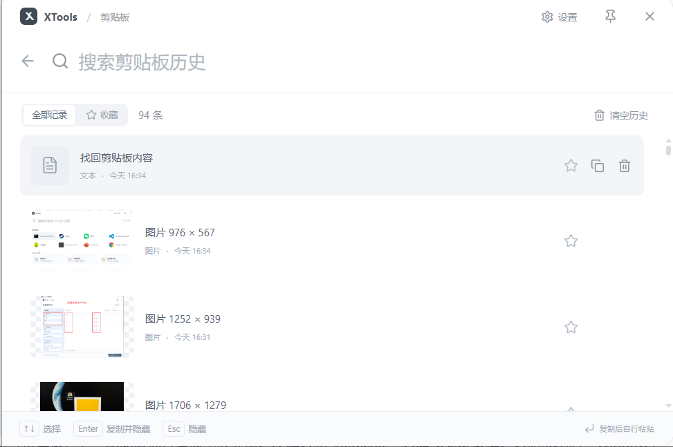
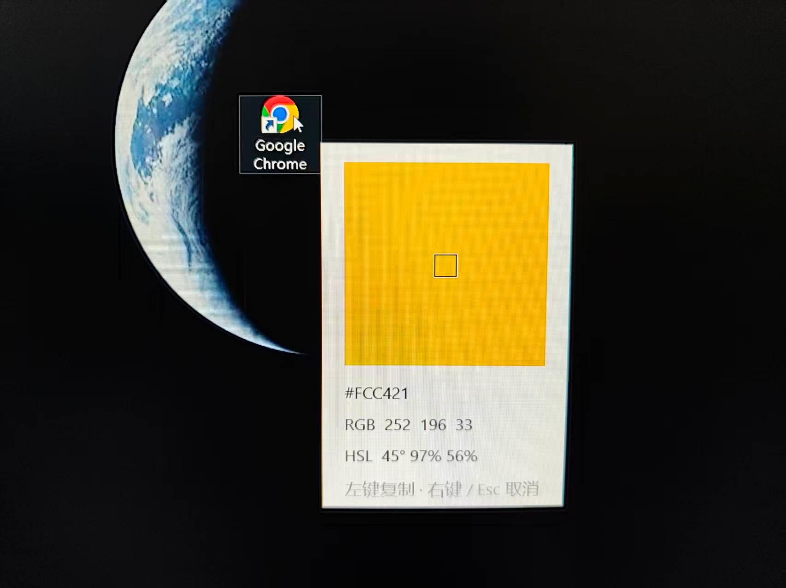

# XTools

**按下 Alt + Space，常用工具就在手边。**

一款 Windows 桌面效率工具，把应用启动、剪贴板历史、屏幕取色和批量重命名放进同一个入口。

[**下载 Windows 安装包**](https://github.com/0Antique/XTools/releases/latest/download/XTools_Setup.exe) · [快速开始](#快速开始) · [反馈问题](https://github.com/0Antique/XTools/issues)

## 它能帮你做什么

| 工具 | 日常用途 |
| --- | --- |
| **应用启动** | 输入应用名称、拼音或首字母，快速找到并打开应用；常用应用会出现在最近使用中。 |
| **剪贴板历史** | 找回复制过的文字、图片和文件路径，搜索历史、收藏常用内容，再次复制使用。 |
| **屏幕取色** | 放大鼠标附近的像素，查看 HEX、RGB、HSL，点击即可复制颜色。 |
| **批量重命名** | 添加前后缀、查找替换、自动编号或调整大小写，先预览再执行，支持撤销上一次操作。 |

## 快速开始

**适用系统：Windows 10 1703 及以上 / Windows 11，x64。**

1. [下载最新安装包](https://github.com/0Antique/XTools/releases/latest/download/XTools_Setup.exe)，直接运行 `XTools_Setup.exe`，无需解压。
2. 选择安装目录，按需勾选桌面快捷方式和开机启动。
3. 启动 XTools 后，按 **`Alt + Space`** 呼出窗口，输入应用名称或选择工具。

系统需要已安装 [Microsoft Edge WebView2 Runtime](https://developer.microsoft.com/microsoft-edge/webview2/)。缺少时安装器会提示；安装器不会自动下载该运行时。

## 日常使用

### 找应用

按 `Alt + Space`，输入名称、拼音或首字母，例如 `微信`、`weixin`、`wx`。使用方向键选中结果，按 `Enter` 打开，也可以直接点击卡片。

### 找回剪贴板内容

打开「剪贴板」，搜索或选择一条历史，按 `Enter` 或点击复制。然后回到目标应用，用 `Ctrl + V` 粘贴。重要记录可以点星标收藏。

默认保留最近 100 条普通历史，收藏单独保留；历史数量可在设置中调整。

### 取一个颜色

打开「屏幕取色」，移动鼠标查看像素放大镜。**左键**复制 `#RRGGBB`，**右键或 Esc** 取消。复制成功后，Windows 系统通知会显示所选 HEX。

### 批量改名

在资源管理器中选中文件，按 `Alt + Space`，打开「批量重命名」即可带入选中项；也可以手动添加或拖入文件、文件夹。

调整规则，检查新名称预览，再点击「执行重命名」。需要恢复时，点击「撤销上一次」。工具只修改所选对象的名称，并保留文件扩展名。

> 从资源管理器带入新批次会替换列表并重置规则；手动添加和拖入会追加到当前列表。

### 设置与悬浮

右上角的 **「设置」** 位于图钉左侧，可以修改快捷键、开机启动、历史数量和最近使用显示。

点击 **图钉** 开启悬浮，窗口会保持置顶；取消悬浮后，点击窗口外部即可隐藏。关闭按钮用于隐藏窗口；需要退出时，在托盘菜单中选择「退出 XTools」。

| 快捷键 | 操作 |
| --- | --- |
| `Alt + Space` | 显示 / 隐藏 XTools |
| `↑` `↓` `←` `→` | 选择应用或工具；搜索框编辑文字时，左右键用于移动光标 |
| `Enter` | 打开所选应用、工具，或重新复制所选历史 |
| `Esc` | 隐藏窗口，或取消取色 |

## 数据留在你的电脑

XTools 无需登录，主要功能可离线使用。设置、历史、收藏和图片保存在 `%APPDATA%\XTools`，便于自行备份。卸载程序会保留这些个人数据。

## 反馈与更多说明

- 遇到问题或有功能建议？[提交 Issue](https://github.com/0Antique/XTools/issues)，附上版本、系统和复现步骤。
- 快捷键被其他软件占用时，可以从托盘打开设置，更换快捷键。
- [版本更新](https://github.com/0Antique/XTools/releases) · [开发与构建](docs/DEVELOPMENT.md) · [版本验收记录](docs/ACCEPTANCE.md)

## Star 趋势

如果 XTools 帮你省下了一点时间，欢迎点一个 ⭐ Star。

<a href="https://www.star-history.com/?repos=0Antique%2FXTools&amp;type=date">
  <picture>
    <source media="(prefers-color-scheme: dark)" srcset="https://api.star-history.com/svg?repos=0Antique/XTools&amp;type=Date&amp;theme=dark" />
    <source media="(prefers-color-scheme: light)" srcset="https://api.star-history.com/svg?repos=0Antique/XTools&amp;type=Date" />
    
  </picture>
</a>

趋势图由 [Star History](https://www.star-history.com/) 动态提供，随服务数据更新；GitHub 图片缓存可能使显示稍有延迟。点击图表可查看详细趋势。

## ☕ 赞赏支持

如果你愿意支持 XTools 的持续维护，可以请作者喝杯咖啡。感谢每一份支持。

<table>
  <tr>
    <th align="center">微信赞赏</th>
    <th align="center">支付宝赞赏</th>
  </tr>
  <tr>
    <td align="center"></td>
    <td align="center"></td>
  </tr>
</table>

使用对应 App 扫码，或点击图片查看原图。
